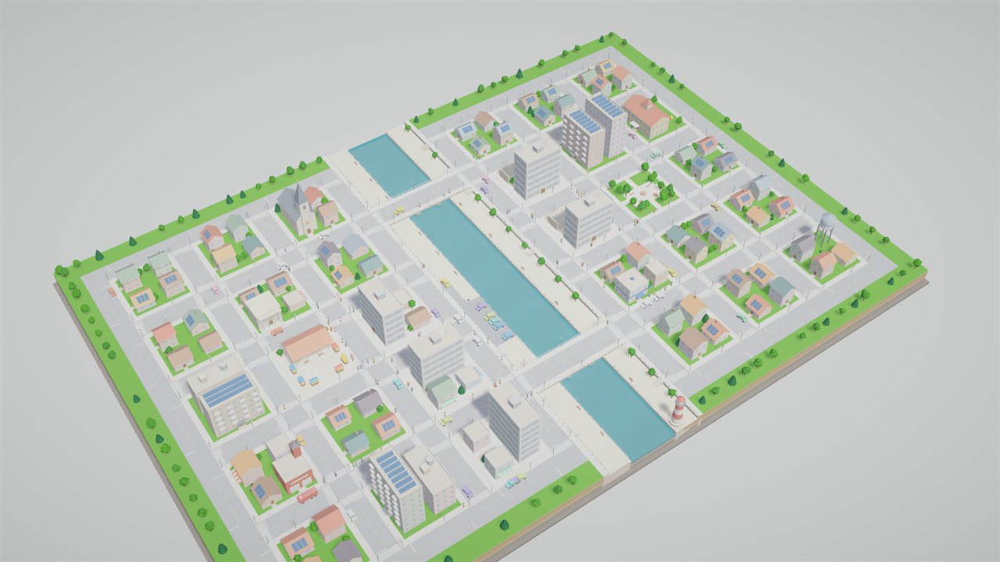
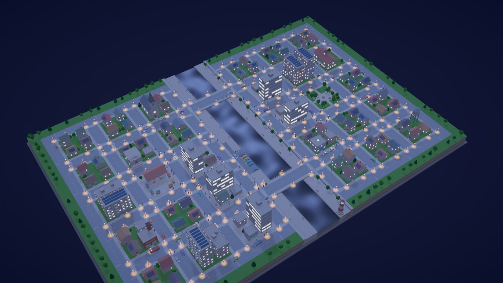
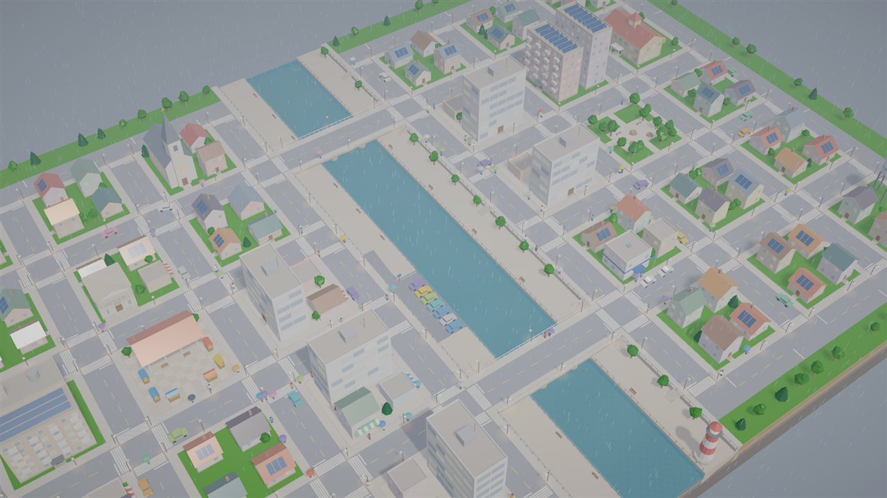
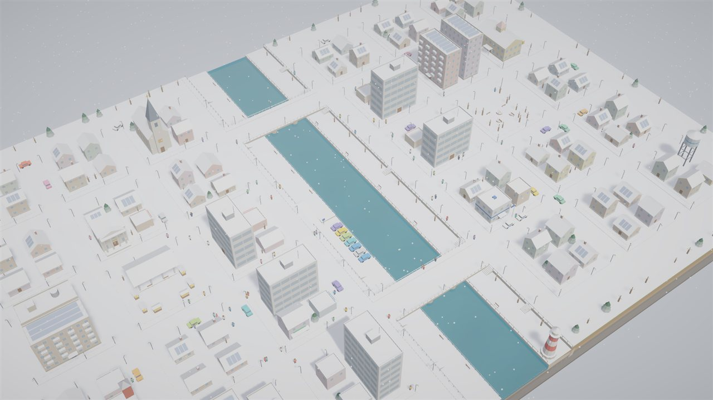
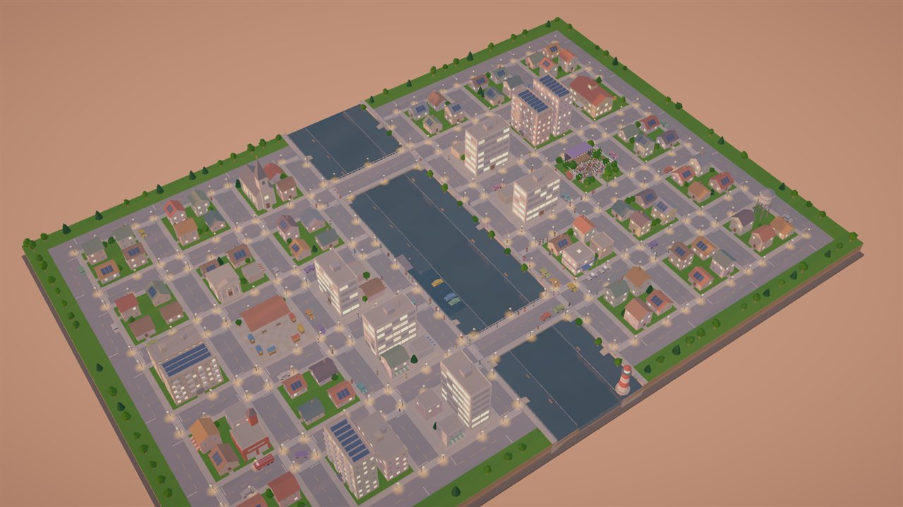
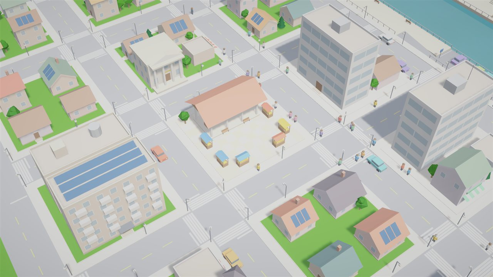
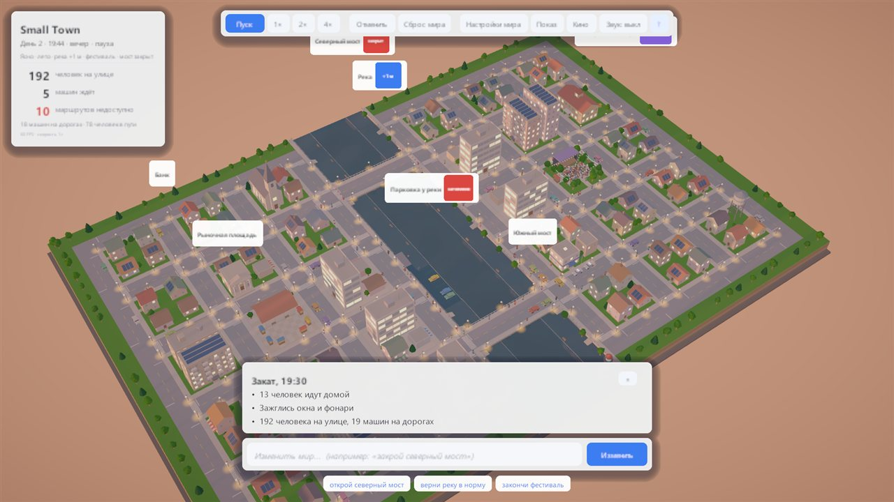

# 🏘️ Small Town

**A living miniature city in Unity 6: residents, traffic, weather, a river and a day/night cycle, all in one deterministic simulation.**

## About

Small Town is an interactive sandbox. Every resident has a home, a job and a route; cars drive through the streets,
the weather changes, and the city reacts to events. You can pause time, speed it up, click anyone to see where they
are going, or change the world with text commands like *"close the north bridge"*.

Everything you see (meshes, materials, the scene, URP settings) is **generated from code**. There are no imported 3D models.

<table>
  <tr>
    <td></td>
    <td></td>
  </tr>
  <tr>
    <td></td>
    <td></td>
  </tr>
  <tr>
    <td></td>
    <td></td>
  </tr>
</table>

## Features

- **Deterministic simulation.** City generation, road graphs, A* pathfinding, residents, traffic and events run in a separate assembly with no `UnityEngine` dependency, so the logic is fully unit-testable.
- **Procedural city.** Blocks, houses, towers, a river with embankments and bridges, parks and landmarks, all built from a seed.
- **Weather and time.** Day, night, sunset, rain, snow, floods, fires and festivals. Street lights and windows turn on in the evening.
- **Text commands (RU / EN).** A small command parser with synonyms, numbers and units: close a bridge, raise the river, start a festival.
- **Inspect anything.** Click a resident or a car to see who they are, what they are doing and their route.
- **Performance.** Procedural meshes with GPU instancing for hundreds of agents.
- **Tests.** 122 EditMode tests, a PlayMode smoke test and automatic screenshot capture.

## Controls

| Action | Input |
|---|---|
| Pan / zoom / rotate | Drag / mouse wheel or pinch / right mouse button |
| Pause / undo | Space / Z |
| Cinematic mode | C |
| Command line | `/` |
| Help | `?` or F1 |

## Run it

1. Install **Unity 6000.5.10f1** through Unity Hub.
2. Unity Hub → **Add project from disk** → this folder.
3. Open `Assets/_Game/Scenes/SmallTown.unity` and press **Play**.

Architecture, tests and all tunable parameters: [docs/DEVELOPMENT.md](docs/DEVELOPMENT.md) (in Russian).

## Tech

Unity 6 · C# · URP · SSAO & post-processing · GPU instancing · Assembly definitions · Unity Test Framework
